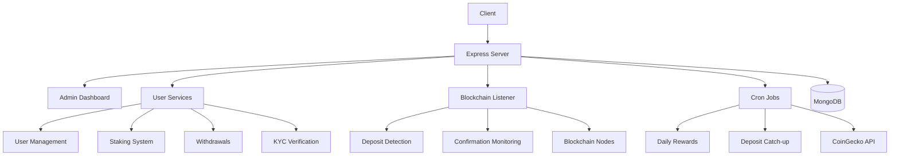
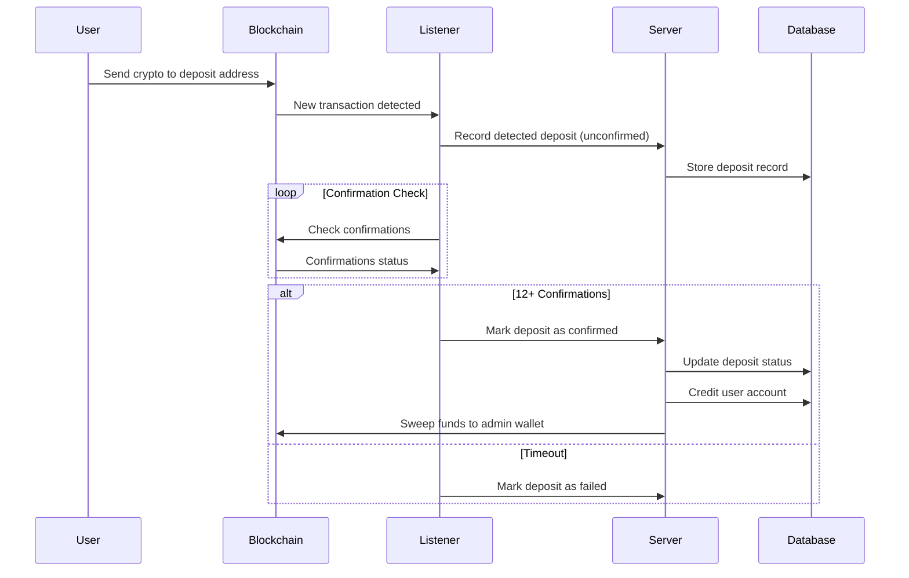
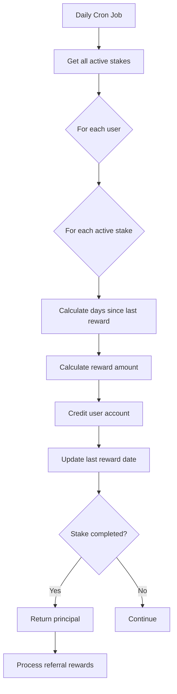

# Ethereum Staking Platform

## Table of Contents
1. [Project Overview](#project-overview)
2. [Features](#features)
3. [Technology Stack](#technology-stack)
4. [Architecture Diagram](#architecture-diagram)
5. [Key Processes](#key-processes)
6. [Setup Guide](#setup-guide)
7. [Configuration](#configuration)
8. [API Documentation](#api-documentation)
9. [Deployment](#deployment)
10. [License](#license)

## Project Overview <a name="project-overview"></a>
This Ethereum staking platform enables users to deposit cryptocurrencies (ETH/USDT), stake their credits, earn daily rewards, and withdraw funds. The system includes a comprehensive admin dashboard for managing users, KYC verification, and withdrawal processing.

## Features <a name="features"></a>
- **User Management**: Registration, login, profile management
- **Wallet Integration**: Ethereum wallet generation and management
- **Staking**: Multiple staking plans with daily rewards
- **Deposit System**: Automatic detection and processing of blockchain deposits
- **Withdrawals**: Secure withdrawal requests with admin approval
- **KYC Verification**: Document upload and admin approval flow
- **Referral Program**: Earn commissions from referred users
- **Admin Dashboard**: User management, stats monitoring, KYC approval
- **Cron Jobs**: Automated daily reward distribution
- **Blockchain Listener**: Real-time deposit detection

## Technology Stack <a name="technology-stack"></a>
| Category           | Technologies                                                                 |
|--------------------|------------------------------------------------------------------------------|
| **Backend**        | Node.js, Express.js, Mongoose                                                |
| **Database**       | MongoDB                                                                      |
| **Blockchain**     | Ethers.js, WebSocket Providers (Alchemy/Infura)                              |
| **Authentication** | JWT, bcrypt                                                                  |
| **Security**       | Helmet, rate limiting, AES-256 encryption for private keys                  |
| **Cron Jobs**      | node-cron                                                                    |
| **Email**          | Nodemailer                                                                   |
| **APIs**           | CoinGecko (price data)                                                       |

## Architecture Diagram <a name="architecture-diagram"></a>


## Key Processes <a name="key-processes"></a>

### Deposit Flow


### Staking Rewards


## Setup Guide <a name="setup-guide"></a>

### Prerequisites
- Node.js v18+
- MongoDB
- Ethereum node access (Alchemy/Infura)
- SMTP email service

### Installation Steps
1. Clone the repository:
```bash
git clone https://github.com/your-repo/ethereum-staking-platform.git
cd ethereum-staking-platform
```

2. Install dependencies:
```bash
npm install
```

3. Create environment file:
```bash
cp .env.example .env
```

4. Generate admin wallet:
```bash
node generateAdminWallet.js
```

5. Start the server:
```bash
npm start
```

## Configuration <a name="configuration"></a>
### Essential Environment Variables
```env
# MongoDB
MONGO_URI=mongodb://localhost:27017/staking-app

# Blockchain
ALCHEMY_API_KEY=your_alchemy_key
INFURA_PROJECT_ID=your_infura_id
USDT_CONTRACT_ADDRESS=0xdac17f958d2ee523a2206206994597c13d831ec7

# Security
JWT_SECRET=your_jwt_secret
ENCRYPTION_KEY=64_char_hex_string

# Admin
ADMIN_WALLET_ADDRESS=generated_admin_address

# Email
EMAIL_HOST=smtp.yourservice.com
EMAIL_PORT=587
EMAIL_USER=your@email.com
EMAIL_PASS=your_password
ADMIN_EMAIL_RECIPIENT=admin@yourcompany.com
```

### Configuration Tips
1. Generate a secure 64-character hex encryption key:
```bash
node -e "console.log(crypto.randomBytes(32).toString('hex'))"
```

2. For production:
- Use process manager (PM2)
- Enable HTTPS
- Set proper file permissions
- Use cloud MongoDB service
- Configure firewall rules

## API Documentation <a name="api-documentation"></a>
### User Endpoints
| Endpoint                | Method | Description                     |
|-------------------------|--------|---------------------------------|
| `/register`             | POST   | Create new account              |
| `/login`                | POST   | Authenticate user               |
| `/api/profile`          | GET    | Get user profile                |
| `/api/staking/plans`    | GET    | List staking plans              |
| `/api/staking/plan`     | POST   | Create new stake                |
| `/api/withdrawal/request`| POST  | Request withdrawal              |

### Admin Endpoints
| Endpoint                         | Method | Description                          |
|----------------------------------|--------|--------------------------------------|
| `/api/admin/stats`               | GET    | System statistics                    |
| `/api/admin/users`               | GET    | List users (paginated)               |
| `/api/admin/kyc/pending`         | GET    | List pending KYC requests            |
| `/api/admin/withdrawals/pending` | GET    | List pending withdrawals             |

## Deployment <a name="deployment"></a>
### Production Recommendations
1. **Process Management**:
```bash
npm install -g pm2
pm2 start server.js --name staking-app
```

2. **Reverse Proxy** (Nginx):
```nginx
server {
    listen 80;
    server_name yourdomain.com;
    
    location / {
        proxy_pass http://localhost:5000;
        proxy_http_version 1.1;
        proxy_set_header Upgrade $http_upgrade;
        proxy_set_header Connection 'upgrade';
        proxy_set_header Host $host;
        proxy_cache_bypass $http_upgrade;
    }
}
```

3. **SSL Certificate** (Let's Encrypt):
```bash
sudo apt install certbot python3-certbot-nginx
sudo certbot --nginx -d yourdomain.com
```

### Monitoring
- Configure log rotation
- Set up health checks
- Implement monitoring (Prometheus/Grafana)
- Configure backup strategy for MongoDB

## License <a name="license"></a>
This project is licensed under the MIT License. See [LICENSE](LICENSE) for details.

```
Note: This README provides a comprehensive overview. For detailed implementation specifics, 
refer to the source code comments and configuration files in the repository.
```
